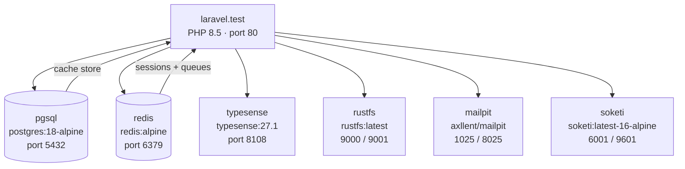

# Architecture

## Docker Services

All services are defined in `compose.yaml` and started via `vendor/bin/sail up -d`.

| Service        | Image                                    | Port(s)                    | Purpose                              |
| -------------- | ---------------------------------------- | -------------------------- | ------------------------------------ |
| `laravel.test` | `sail-8.5/app`                           | 80, 5173                   | PHP 8.5 app + Vite dev server        |
| `pgsql`        | `postgres:18-alpine`                     | 5432                       | Primary database                     |
| `redis`        | `redis:alpine`                           | 6379                       | Sessions and queues                  |
| `typesense`    | `typesense/typesense:27.1`               | 8108                       | Full-text search (Scout driver)      |
| `rustfs`       | `rustfs/rustfs:latest`                   | 9000 (API), 9001 (console) | S3-compatible object storage         |
| `mailpit`      | `axllent/mailpit:latest`                 | 1025 (SMTP), 8025 (UI)     | Local mail capture                   |
| `soketi`       | `quay.io/soketi/soketi:latest-16-alpine` | 6001 (WS), 9601 (metrics)  | WebSocket server (Pusher-compatible) |

## Environment Drivers

Configured in `.env.example`:

| Driver                 | Value       | Notes                                                  |
| ---------------------- | ----------- | ------------------------------------------------------ |
| `DB_CONNECTION`        | `pgsql`     | PostgreSQL 18 via `pgsql` container                    |
| `SESSION_DRIVER`       | `redis`     | Sessions stored in Redis                               |
| `QUEUE_CONNECTION`     | `redis`     | Jobs dispatched from Redis queue                       |
| `CACHE_STORE`          | `database`  | Cache stored in PostgreSQL                             |
| `FILESYSTEM_DISK`      | `s3`        | Routes to RustFS via `AWS_ENDPOINT=http://rustfs:9000` |
| `SCOUT_DRIVER`         | `typesense` | Full-text search via Typesense 27.1                    |
| `BROADCAST_CONNECTION` | `log`       | Broadcasting is log-only by default                    |

## Service Topology



## Directory Layout

```
.
├── app/                  # PHP application code
│   ├── Http/             # Controllers, middleware, requests
│   ├── Models/           # Eloquent models
│   └── Providers/        # Service providers
├── config/               # Laravel configuration files
├── database/
│   ├── migrations/       # Database migrations
│   └── seeders/          # Database seeders
├── docs/                 # This documentation (VitePress)
│   └── .vitepress/       # VitePress config (TypeScript)
├── resources/
│   ├── js/               # Frontend entry point (app.js)
│   └── views/            # Blade templates
├── routes/
│   └── web.php           # Web routes
├── tests/                # PHPUnit / Pest test suite
├── compose.yaml          # Docker Compose service definitions
├── package.json          # Frontend dependencies (Vite, Tailwind CSS)
├── composer.json         # PHP dependencies (Laravel 13)
└── vite.config.js        # Vite build configuration
```
